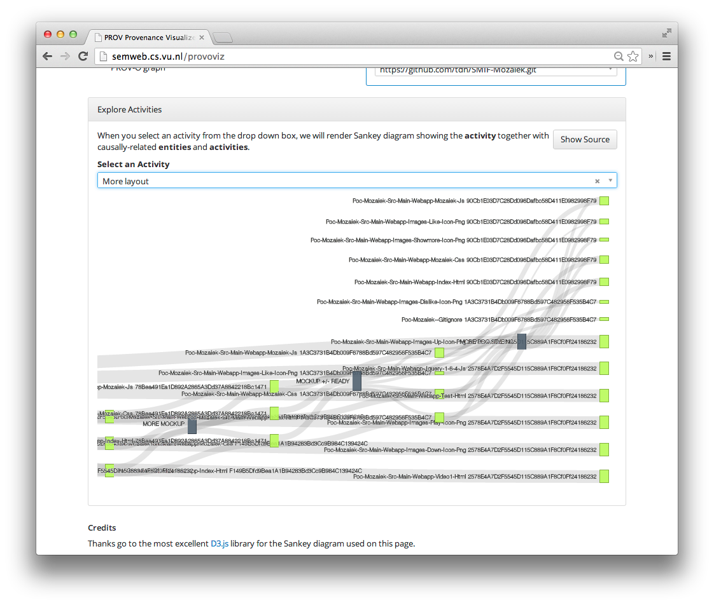

## PROV-O-Viz

Copyright © Rinke Hoekstra, VU University Amsterdam, 2013

<h4>About</h4>

With PROV-O-Viz you can visualize <em>any</em> provenance graph expressed using the <a href="http://www.w3.org/TR/prov-o/" target="_blank">W3C PROV-O vocabulary</a> as an intuitive <a href="http://bost.ocks.org/mike/sankey/" target="_blank">Sankey diagram</a>. Really neat.

PROV-O-Viz was developed by the <a href="http://www.data2semantics.org" target="_blank">Data2Semantics</a> project, funded under the <a href="http://www.commit-nl.nl" target="_blank">COMMIT/ programme</a>.

<h4>How to use it</h4>

Go to the PROV-O-Viz website at <a href="http://provoviz.org">http://provoviz.org</a>

To see what it does, you can point PROV-O-Viz to your own SPARQL endpoint, containing Named Graphs with PROV-O activities and entities in it.

Alternatively, you can simply copy and paste some of PROV-O in Turtle format in the Paste-And-Go form.

Finally, you can POST PROV-O in Turtle format to the PROV-O-Viz service, and we'll return a self-contained HTML snippet for you to include in your website.

<ul>
	<li>The service lives at <code>http://provoviz.org/service</code>, and</li>
	<li>expects a POST with a <code>graph_uri</code> parameter (a URI that identifies your provenance graph), and</li>
 	<li>a <code>data</code>	parameter that contains a Turtle serialization of a PROV-O graph</li>
</ul>

